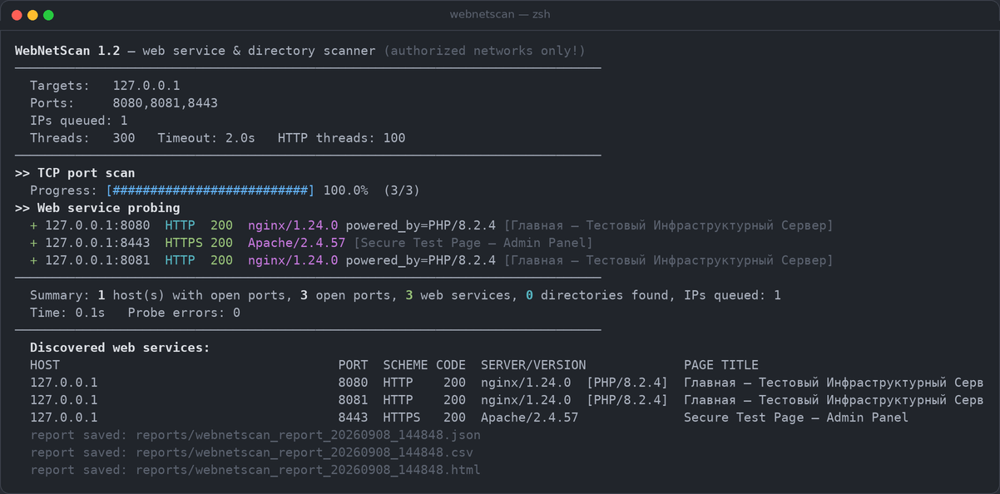
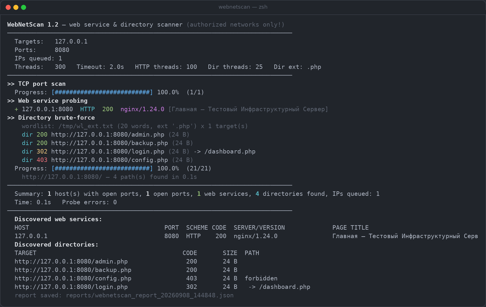
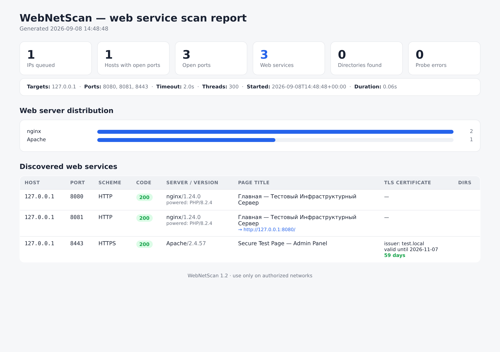

# WebNetScan


Cross-platform web service & directory scanner for **Linux, macOS and
Windows**: scans networks by ranges, discovers HTTP/HTTPS ports, fingerprints
web server versions, inspects TLS certificates and brute-forces directories
with a wordlist — including optional file extensions (`--dir-ext .php`).

Written in pure Python 3.8+ with **zero external dependencies** — standard
library only. Runs anywhere Python runs.

> ⚠️ **Legal notice.** Use this scanner only on your own networks or with
> written permission from the infrastructure owner. Unauthorized scanning
> may be illegal.

---

## Screenshots

| Network scan | Directory brute-force with `--dir-ext .php` |
|---|---|
|  |  |

| Self-contained HTML report |
|---|
|  |

---

## Features

- **Targets**: single IP, CIDR (`192.168.1.0/24`), ranges (`10.0.0.1-10.0.0.254`,
  `192.168.1.10-50`), domains (with A-record resolution), target files
  (`@targets.txt`), comma-separated combinations. IPv4 and IPv6.
- **Ports**: arbitrary lists and ranges (`80,443,8000-8100`), presets
  (`web`, `extended`, `top`).
- **Protocol detection**: automatic HTTP/HTTPS recognition on any port,
  including non-standard ones.
- **Web server fingerprinting**:
  - `Server` — name and version (nginx/1.24.0, Apache/2.4.57, IIS/10.0, …);
  - `X-Powered-By` — PHP/8.2.1, ASP.NET, etc.;
  - HTTP status code, `Content-Type`;
  - page `<title>`;
  - redirect chain (http→https, domains, relative Location);
  - TLS certificate for HTTPS: subject/issuer CN and O, validity,
    days until expiration, SAN domains, self-signed flag.
- **Directory brute-force** (1.1, extended in 1.2): discovers directories and
  files on every found web service using a wordlist
  (bundled `directory-list-2.3-medium.txt`, ~220,560 entries) or any custom
  wordlist. Optional file extension per word (`--dir-ext .php`, `.jsp`, …) —
  the scanner appends it to every dictionary entry. Soft-404 aware,
  keep-alive connections for speed. Results are written to every report
  format.
- **Banners** of non-HTTP ports (SSH, FTP, etc.) — useful for inventory.
- **Speed**: asynchronous engine (asyncio), configurable concurrency —
  a /24 with four ports takes seconds.
- **Reports**: colored console (live progress), **JSON**, **CSV** (Excel with
  BOM and `;` separator), **HTML** (self-contained, English UI).
- **Ctrl+C**: graceful interruption with partial results saved.

---

## Installation

Only Python 3.8+ is required (`python3 --version`). No installation needed —
just run from the project directory.

```bash
# Linux / macOS
python3 webnetscan.py --help

# Windows
python webnetscan.py --help
```

Dependencies: **none** (see `requirements.txt`).

### Platform notes

- **Linux / macOS** — run the source natively (see above). On macOS you can
  also double-click `webnetscan.command` in Finder to open the interactive
  menu, or pass flags to it: `./webnetscan.command -t 192.168.1.0/24`.
  Do not run the Windows `.exe` under Wine on macOS — it is a Windows x64
  binary and Wine is neither required nor reliable there (especially on
  Apple Silicon); the source needs only `python3`, which macOS already has.
- **Windows** — use the portable bundle `webnetscan-1.2.0-windows-x64.zip`
  (embedded Python, no installation): `webnetscan.exe` (double-click =
  interactive menu) and `webnetscan.cmd` (command line with flags). See
  `README-WINDOWS.txt` inside the bundle. A single-file exe can be built on
  any Windows machine with the bundled `build_exe_on_windows.bat`
  (PyInstaller). The build script requires Python 3.9-3.13 (standard
  python.org install); on very new builds such as Python 3.14 from the
  new Python install manager / Microsoft Store, PyInstaller itself may
  fail with a `pywintypes` import error — the script detects it and
  applies known fixes, but if they do not help, build with Python
  3.9-3.13 instead. The portable bundle does not depend on this.

---

## Quick start

### Interactive menu (no arguments)

```bash
python3 webnetscan.py
```

The wizard walks through: targets → ports → settings → directory brute-force
→ report formats → scan.

### Command line

```bash
# /24 subnet, popular web ports, all report formats
python3 webnetscan.py -t 192.168.1.0/24 -p web -o all --out-dir reports

# Range + port list
python3 webnetscan.py -t 10.0.0.1-10.0.0.50 -p 80,443,8080-8090,8443

# Domain with resolution and verbose output
python3 webnetscan.py -t example.com -v

# Several targets at once
python3 webnetscan.py -t 192.168.1.0/24,10.0.4.1-10.0.4.9,@targets.txt -p 80,443

# Directory brute-force with the bundled wordlist (~220k entries)
python3 webnetscan.py -t 192.168.1.0/24 --dirlist

# Directory brute-force with a custom wordlist and 200 parallel requests
python3 webnetscan.py -t 192.168.1.0/24 --dirlist wordlists/custom.txt --dir-concurrency 200

# Directory brute-force looking for PHP files only: /<word>.php for every word
python3 webnetscan.py -t 192.168.1.0/24 --dirlist --dir-ext .php

# Directory brute-force with your own extension
python3 webnetscan.py -t 192.168.1.0/24 --dirlist --dir-ext .jsp

# Polite mode for production networks: pause and limited parallelism
python3 webnetscan.py -t 192.168.1.0/24 -p 80,443 -c 50 --delay 0.02

# Console only, no color (e.g. in CI)
python3 webnetscan.py -t 192.168.1.0/24 -o none --no-color
```

### Arguments reference

```
-t, --targets TARGET...   IP, CIDR, range, domain or @file (multiple allowed)
-p, --ports PORTS         80,443,8000-8100 or preset: web | extended | top
    --timeout SEC         TCP connect timeout (2.0)
-c, --concurrency N       simultaneous TCP connects (300)
    --http-concurrency N  simultaneous HTTP probes (100)
    --dirlist [FILE]      directory brute-force; 'auto' = bundled wordlist
    --dir-concurrency N   simultaneous directory requests (100)
    --dir-ext EXT         append a file extension to every word (e.g. .php,
                          .jsp, asp); 'none' or empty = plain words (default)
-o, --output FORMATS      json,csv,html | all | none (all)
    --out-dir DIR         report directory (current)
    --no-redirects        do not follow redirects
    --max-redirects N     redirect chain length (5)
    --no-banner           do not grab non-HTTP banners
    --delay SEC           pause after each connect (0)
-v, --verbose             verbose output (headers, banners, non-HTTP ports)
    --no-color            disable colors
-i, --interactive         interactive menu
-V, --version             version
```

---

## Port presets

| Preset     | Ports |
|------------|-------|
| `80,443`   | CLI default |
| `web`      | 80, 443, 8080, 8443 |
| `extended` | 80, 443, 591, 3000, 5000, 7001, 8000, 8008, 8080, 8081, 8443, 8843, 8888, 9090, 9443, 10443 |
| `top`      | 30 most common web ports |

---

## Directory brute-force

Enabled by `--dirlist` (CLI) or step [4/5] of the interactive menu:

```bash
webnetscan -t 192.168.1.10 --dirlist                 # bundled wordlist
webnetscan -t 192.168.1.10 --dirlist my-words.txt    # custom wordlist
webnetscan -t 192.168.1.10 --dirlist --dir-ext .php  # probe /<word>.php
```

### File extensions (--dir-ext)

By default every word is probed as a plain path (`/admin`). With `--dir-ext`
the scanner appends the extension to the end of every word from the wordlist:

| Mode                  | Request for word `admin` |
|-----------------------|--------------------------|
| (default, none)       | `GET /admin`             |
| `--dir-ext .php`      | `GET /admin.php`         |
| `--dir-ext .jsp`      | `GET /admin.jsp`         |
| `--dir-ext asp`       | `GET /admin.asp`         |

- The extension may be given with or without the leading dot; `none`, `-` or
  an empty value means plain words. The same question is asked in step [4/5]
  of the interactive menu.
- Accepted form: 1-10 letters/digits (`.php3`, `.html5`, `.bak` are fine).
- The extension is also appended to the random soft-404 baseline path, so the
  not-found filtering stays accurate for the chosen extension.
- Found paths are recorded as they were probed (e.g. `/admin.php`).

How it works:

1. After the port/probe phases, every discovered web service gets brute-forced
   on its **final** base URL (redirects are taken into account; two services
   pointing at the same server are scanned once).
2. Requests are `GET /<word>` with **HTTP keep-alive** — each worker reuses
   its connection, which is what makes ~220k words feasible.
3. **Soft-404 filtering**: a random baseline path is probed first; responses
   matching the baseline (same status + near-identical body size, or the same
   redirect target) are treated as "not found". Plain `404` is always skipped.
4. Everything else is reported as found: `200`, `301/302/307/308` (with the
   redirect target), `401`, `403` (marked *forbidden*), etc.
5. Found paths are written to the console live, then to JSON (`dirs` array
   per service), the HTML report (dedicated section), and — when CSV output
   is requested — an additional `webnetscan_report_*_dirs.csv` file.
6. The scanner aborts a target only when the server is truly gone (a long
   streak of 300 consecutive transport failures with no success) and always
   records the failure in the report.

Wordlist notes:
- Bundled file: `wordlists/directory-list-2.3-medium.txt`
  (Copyright 2007 James Fisher, CC-BY-SA 3.0).
- Any text file works: one entry per line, blank lines and `#comments` are
  skipped, duplicates removed, order preserved.
- Empty responses of nonexistent paths never crash the scan; per-request
  read timeout is `--timeout`-independent (5 s by default).

Performance guidance: the default `--dir-concurrency 100` suits most networks.
For a single fast host you can raise it to 300–500; for fragile embedded
devices lower it to 20–50.

---

## Report formats

Files are created with a timestamp: `webnetscan_report_20260908_153045.json`
etc. On interruption (Ctrl+C) a `_partial` suffix is added.

- **JSON** — full structure: config, summary, all hosts and services
  (headers, redirects, TLS, `dirs` array, errors). For scripts and SIEM.
- **CSV** — flat table with `;` separator and BOM (`utf-8-sig`), opens in
  Excel/LibreOffice as-is. Includes `dirs_found` per service. When
  directories were found, a second `*_dirs.csv` contains each path.
- **HTML** — self-contained page (inline styles): summary cards, web server
  distribution, service table with TLS and certificate lifetime, dedicated
  "Discovered directories" section.

---

## How it works

1. **Producer** lazily generates "IP × port" pairs — even a /8 won't use memory.
2. A **worker pool** (`-c`) performs TCP connects with a timeout.
3. Each **open port** immediately goes to an HTTP probe: HTTPS first for
   TLS-like ports (443/8443…), otherwise HTTP first, then the other.
4. A valid HTTP response → parse headers, version, `<title>`, redirects,
   TLS certificate (custom ASN.1/DER parser — no `cryptography` needed).
5. Optional **directory brute-force** phase runs over the discovered services.
6. Results are aggregated per host and printed live.

Administrator privileges are **not required** — plain TCP connect is used.

---

## Project layout

```
webnetscan/
├── webnetscan.py         # launcher (python webnetscan.py ...)
├── requirements.txt      # empty: no dependencies
├── README.md
├── docs/
│   └── screenshots/      # images used by this README
├── wordlists/
│   └── directory-list-2.3-medium.txt   # bundled brute-force wordlist
└── webnetscan/
    ├── __init__.py       # version
    ├── __main__.py       # python -m webnetscan
    ├── cli.py            # argparse, config building, launch
    ├── menu.py           # interactive wizard
    ├── targets.py        # IP/CIDR/range/domain parsing
    ├── ports.py          # port parsing, presets
    ├── engine.py         # async engine (producer-workers-probes)
    ├── http_probe.py     # HTTP/1.1 client, fingerprint, redirects
    ├── dirbuster.py      # directory brute-force (keep-alive, soft-404)
    ├── tlsinfo.py        # ASN.1/DER X.509 parser
    ├── models.py         # result dataclasses
    ├── report.py         # console output, colors, progress
    └── exporters.py      # JSON / CSV / HTML
```

---

## FAQ

**"Dead" addresses scan slowly?** Lower the timeout (`--timeout 1`) — most
of the waiting time is spent on unreachable hosts.

**Windows Firewall asks for permission?** Allow access to private networks —
the scanner needs outbound TCP.

**The server hides its version in `Server`?** That's normal: admins often
strip the header. WebNetScan then shows only the name, or a dash.

**How to scan IPv6 subnets?** Use CIDR like `2001:db8::/64` — supported the
same way as IPv4.

**Where do I get a target list file?** One target per line; lines starting
with `#` are ignored: `@targets.txt`.

**Does directory brute-force follow redirects per word?** No — redirect
targets are recorded in the report instead, which is faster and more
informative (a redirect to `/login` is a finding on its own).
